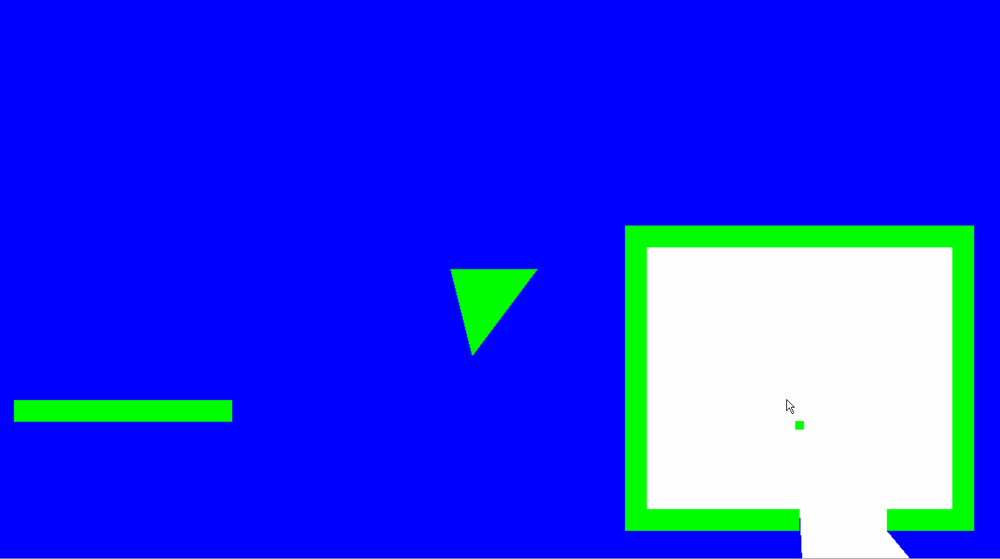

# Field of View for Top-Down Games

This algorithm calculates the areas on screen the player shouldn't be able to see.

## How It Works

### Inputs

The algorithm is given 3 inputs:

1. The player's position *p*

2. The vertices of the opaque wall

3. The four points which define the world's border: *NW*, *NE*, *SE*, *SW*.

The wall MUST be convex.

### Outputs

A convex polygon that defines where the wall obstructs the player's view.

### Algorithm

Generating Potential Points:

For each vertex *v* defining the wall, a point *g* along the world's border is generated. *g* satisfies two conditions:

1. *g* is on the line defined by *p* and *v*.

2. *v* is inbetween the points *p* and *g*.

Condition 2 prevents points from being generated on the world border "behind" the player.

Each *v* and *g* pair is put into a list of potential points. These are points that may be a part of the final polygon. 

Each *v* is also put into one of four groups - *N*, *E*, *S*, *W* - depending on which side of the world border *g* is on. This grouping becomes important in the next step.

"Corner" Cases:

The final polygon may have world border points (*wbp*s) within it. How do we know which ones?

1. Pick a point from each group. (*N*, *E*, *S*, *W*)
2. For each possible pair of points,
	- Define a line between them.
	- Add the *wbp*s on the side of the line opposite to the player to the list of potential points.

Finally:

Determine the final points of the final polygon by using a convex hull algorithm on the list of potential points.
